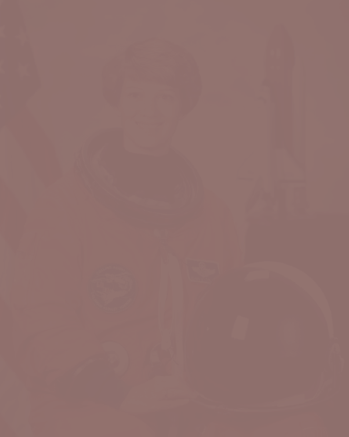

# Any image in any colormap 🎨🐍


[](https://github.com/psf/black)
[](https://github.com/pre-commit/pre-commit)
[](https://github.com/dwyl/esta/issues)

[](https://coveralls.io/github/frans-johansson/pylettize?branch=main)

Have you ever been in the middle of creating the ultimate *aesthetic* set up only to find that your favorite wallpaper does not vibe with your new color scheme? Well, fret not, `pylettize` is here for you. This is a simple piece of software allowing you to apply custom color palettes to any image you can think of. Need that classic Bliss™️ re-cast in Gruvbox colors? Look no further!


> **Note:** This project is still in development, without a clear release date set. It is useable at the moment, but might require a bit of hacking on your end if you want it to work exactly as you want. If you want to contribute in any way shape or form, check out the contribution guidelines below!

## Installation and usage
In its current state, the project must be installed "from source" (i.e. it is not hosted on PyPI or similar yet). Ideally the following steps would be done in a virtual environment with a minimum `pip` version of `v22.2.2`:

```sh
git clone https://github.com/frans-johansson/pylettize.git
cd pylettize
pip install -e .
```

After installing, you should now be able to run `pylettize --help` and see the general usage instructions. As an example though, to apply the default *gruvbox* palette to *cat.png* (which some of you might recognize as Chelsea the cat from Scikit-Image), you would run the following command:

```sh
pylettize soft cat.png gruvbox -o aesthetic_cat.png -T 0.05
```

which will save your output to a file called *aesthetic_cat.png*. The `-T 0.05` option sets the *temperature* value for the soft blending operation. Basically, a higher value means the colors become less distinct and more "smooth", but more on this in the next section.


## Features
The `pylettize` utility currently supports two main blending modes: hard and soft. These can be applied with either custom palette file by supplying the `-p` flag before the palette name (instead pointing to your custom palette) or to one of the followoing **default palettes**:

- `gruvbox`, based on the color scheme by morhetz
- `obama`, drawing from the colors of the hope posters
- `primaries`, simply CMY and RGB in their purest forms

Though as mentioned, any text file containing hexcolors separated by newlines can be used as a palette. Here's a (spooky 🧛) example free of charge!

```txt
#44475a
#f8f8f2
#6272a4
#8be9fd
#50fa7b
#ffb86c
#ff79c6
#bd93f9
#ff5555
#f1fa8c
```

### Hard blending
The simplest kind of blending supported currently is `hard` blending. This simply sets each pixel in the output image to its nearest palette color in RGB space, utilizing the euclidean distance. The effect can be kind of rough and noisy, which is certainly a look you could shoot for if you want. If, however, you'd like a more smooth look: keep reading!


### Soft blending
The main difference when using the `soft` option is that each pixel in the output image becomes a linear combination of several palette colors. As with the hard blending option, the euclidean distance measure in RGB space is used. However, this value is normalized and inverted to get a similarity measure instead. Then, the distribution of these similarity values across the palette colors is passed through a *temperature scaled softmax transform*, which can either make the distribution more or less concentrated using the `-T` temperature option. Generally speaking, and as indicated below, a higher temperature value means "smoother" colors and a lower value means more distinct colors.

| Temperature value | Result |
| --- | --- |
| Original | |
| T=0.25 | |
| T=0.1 | |
| T=0.05 |  |


Care should be taken when setting the temperature to low or too high though, as indicated below.

| Temperature value | Result |
| --- | --- |
| T=10 | | 
| T=0.001 |  |


### Additional planned features
To round off this section, here are some planned features for the future of this little project.

- Automatic palette extraction using clustering algorithms
- 1-to-1 palette mappings using association algorithms
- A hosted, installable package on PyPI (yes, you'll be able to `pip install` it!)
- More default palettes!

## Contribution guidelines
To get started, make sure you have the following requirements satisfied on your machine:

- `pip v22.2.2`
- `pipenv v2022.10.12`
- Any `python3` version, but 3.8 is recommended

Set up a local virtual environment by running `pipenv install --dev` in the project root directory (where the Pipfile is). You can then activate this environment by running `pipenv shell` in the same directory. To check if this step worked, try running `which python` and verify that you get a path to some sort of "virtualenv" as output.

Optionally, but highly recommended to avoid headaches when submitting PRs, is to set up pre-commit hooks with `pre-commit install` in the project root (where the .pre-commit-config.yaml file is). This should ensure that your PR at least has style compliant code ✨. If you'd like to be told your code is bad before commiting, feel free to set up linting in your editor of choice. We use `flake8` with a bunch of plugins (including `mypy` and `isort`) to run the style checks, so ideally you'd want to use `flake8` locally for linting as well. In Visual Studio Code, adding the following to your settings file should suffice:

```json
{
    "python.linting.enabled": true,
    "python.linting.flake8Enabled": true,
    "python.formatting.provider": "black",
}
```

This will also enable you to format your code with our formatter of choice `black` in the editor.

We use `pytest` as our testing framework. It should be set up such that you can simply run `pytest`.

Feel free to submit PRs with any additions you'd like to see made to the project! We only ask that you stick to the coding guidelines (i.e. what flake8 tells you to do), and that you associate each PR with some Issue. If there isn't an issue yet for what you want to add, create one! Don't worry too much about how to format these, or what labels to use. Simply try to convey what it is you're looking to implement, change or fix.
